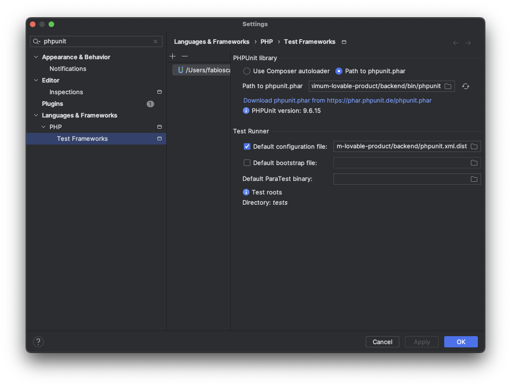

# Xcl Table Tennis League

A web app to keep track of wins and losses in the Xcl Table Tennis League (and pretty much any other game)

## Folder structure

The project is structured as follows.

| Folder                      | Description                                                                                |
|-----------------------------|--------------------------------------------------------------------------------------------|
| bend/src/Controller         | The controllers exposing a set of REST API consumed by the frontend.                       |
| bend/src/DataTransferObject | The classes used to serialize and deserialize data sent to and received from the frontend. |
| bend/src/Entity             | The classes abstracting the data entities.                                                 |
| bend/src/Repository         | The classes interacting with the database.                                                 |
| bend/tests/Controller       | The integration tests of the controllers.                                                  |

## Remarks

The test environment is configured NOT to commit transactions, which means that tests do not actually alter the test database.

## Getting started

Clone the repo.

Start the containers using the following command.

```
make up
```

Create the test database and perform the migrations on both the development and the test databases using the following command.

```
make init
```

When necessary, drop, recreate, and perform the migrations on both the development and the test databases using the following command.

```
make reinit
```

Execute all the tests using the following command.

```
make test
```

Connect to the shell of the backend container using the following command.

```
make bash-bend
```

Connect to the shell of the frontend container using the following command.

```
make bash-fend
```

Stop all the containers and remove orphans using the following command.

```
make down
```

Stop all the containers and remove orphans and volumes using the following command.

```
make down-vols
```

### Important

The test environment is configured NOT to commit transactions, which means that tests do not actually alter the test database.

## Local development environment setup

This section describes how to set up the local development environment from scratch.

### Homebrew

```
/bin/bash -c "$(curl -fsSL https://raw.githubusercontent.com/Homebrew/install/HEAD/install.sh)"
```

### PHP

```
brew install php
```

### Composer

```
php -r "copy('https://getcomposer.org/installer', 'composer-setup.php');"
php -r "if (hash_file('sha384', 'composer-setup.php') === 'e21205b207c3ff031906575712edab6f13eb0b361f2085f1f1237b7126d785e826a450292b6cfd1d64d92e6563bbde02') { echo 'Installer verified'; } else { echo 'Installer corrupt'; unlink('composer-setup.php'); } echo PHP_EOL;"
php composer-setup.php
php -r "unlink('composer-setup.php');"
sudo mv composer.phar /usr/local/bin/composer
```

Execute the following command from the `backend` folder to restore the packages.

```
composer install
```

### Symfony

```
brew install symfony-cli/tap/symfony-cli
```

### Integrate PHPUnit with IntelliJ IDEA

The following screenshot shows the configuration of PHPUnit in IntelliJ IDEA.



### Next.js

```
npm install next react react-dom
```

## Execution

Execute the following command from the `backend` folder to launch the backend.

```
symfony server:start
```

Execute the following command from the `frontend` folder to launch the frontend.

```
npm run dev
```

In order to support the authentication/authorization flow, add the following entry to your `hosts` file – `/private/etc/hosts` on macOS.

```
127.0.0.1       xttl.local
```

Connect to the frontend using the following URL.

http://xttl.local:3000

